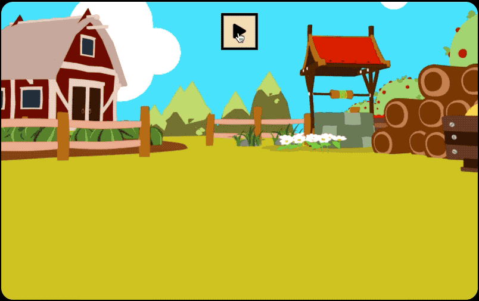

# JAVASCRIPT

> Frontend의 기본은 JavaScript 라고 생각하여 베이직 부터 공부한 내용 입니다.

#### WEB API

- coordinates
- load
- resize
- scroll

#### DOM

- Render Tree

- DOM에 접근해서 Shopping List 만들어보기

#### EVENT

- delegation
- capture
- prevant

#### 게임만들기

- 타이머 설정후, 정해진 시간안에 당근을 모두 클릭 해야 하는 게임  
- JavaScript 한 페이지에 다 작성후 기능별로 Class로 분리.

  

- 느낀점 : 하나하나 만들어지는 화면을 볼때마다 너무 즐거웠다. 거의 기능하나 추가하고 에러잡고, 추가하고 에러잡고의 반복 이었지만, 전에는 에러를 마주했을때 그저 당황스러웠다면 이번에는 더 호기심이 생기고 어떻게 해결할수 있을까를 고민하는것이 즐거웠다.
  강의를 들으며 만든 게임이니 만큼, 이 내용을 토대로 얼른 다른 것들을 만들어보고 싶다.

  그리고 확실히 React와 다른점이, 리액트를 사용할때에는 돔에 접근하기도 쉽고, 하나의 컴포넌트 안에서 구조와 기능을 한눈에 볼수있아 편했지만, 바닐라자바스크립트를 해보니 HTML,CSS,JavaScript 파일이 다 달라서 조금 번거로왔다.

- 아쉬웠던점 : 타이머 만드는데에 있어서 어려움이 느껴진다. 다른 프로젝트 들을 진행하며 타이머를 가지고 더 이것저것 만들어 보야 겠다. 타이머를 이용해서 무언가를 만들때마다 강의와 구글링을 통해 어떻게 만들긴 하지만 아직 제대로 이해가 가지 않는다.
